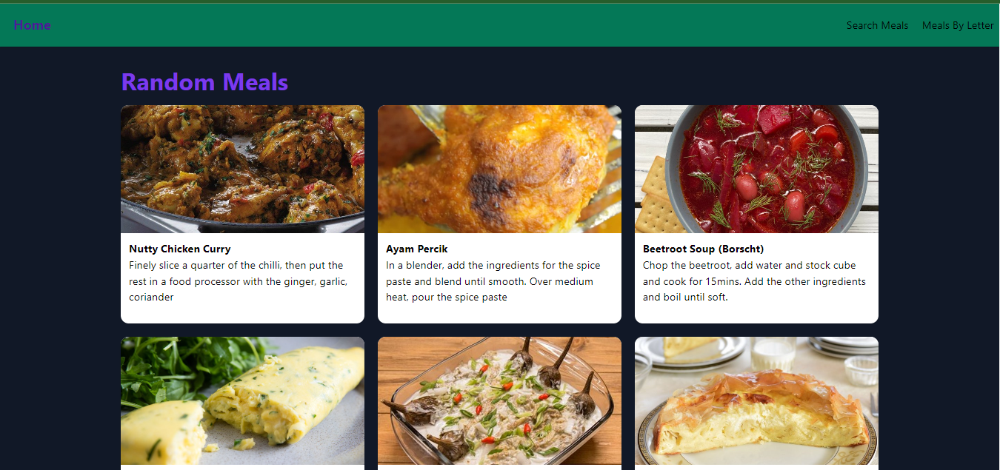
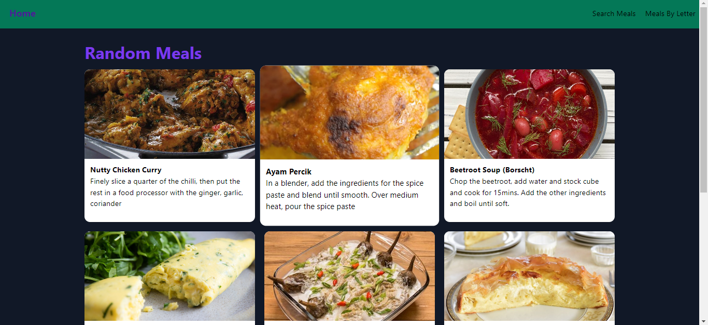
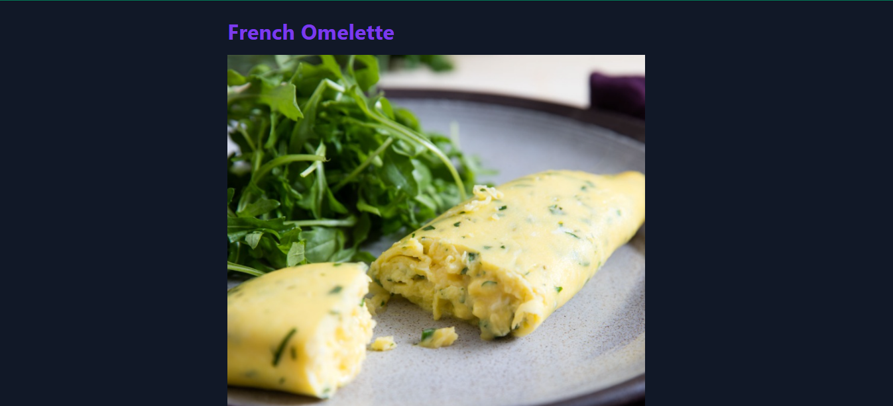
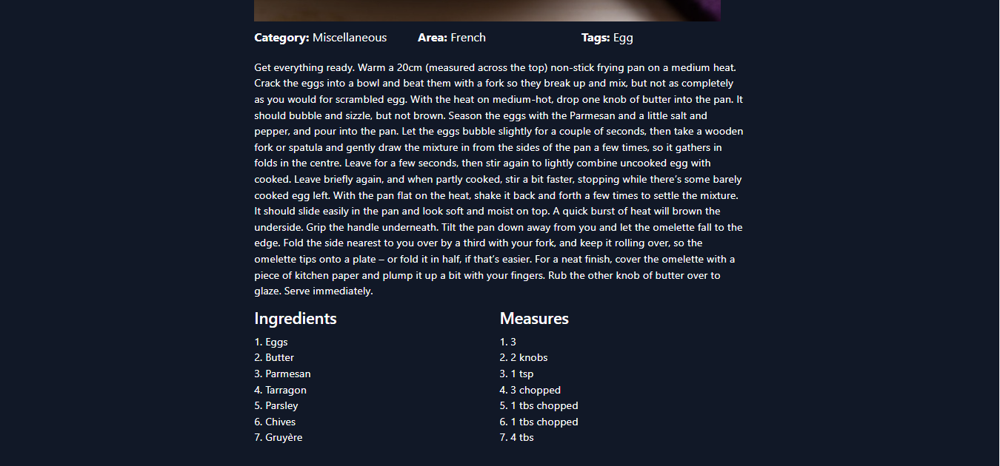
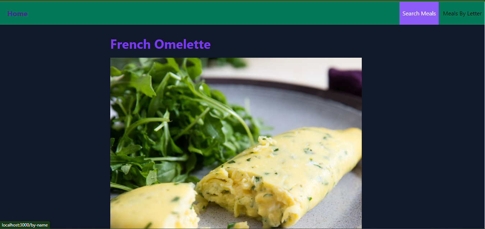
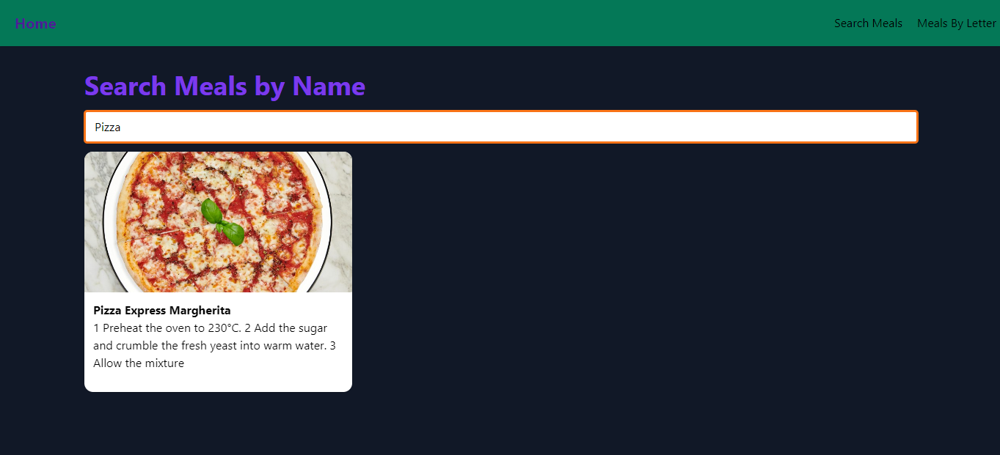
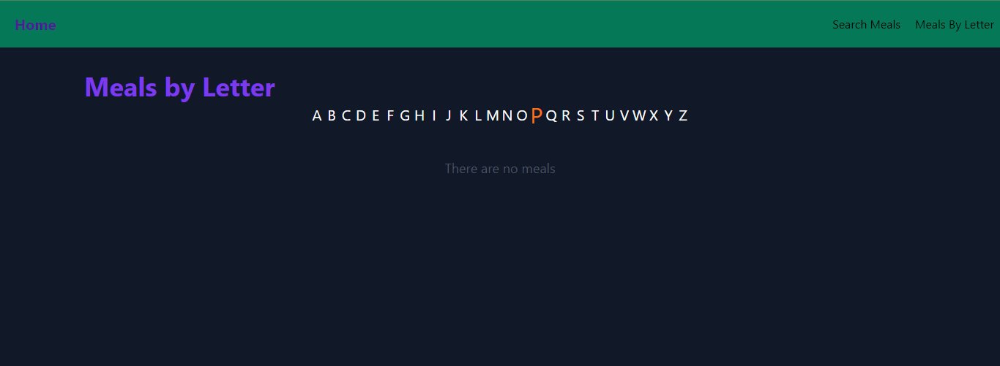
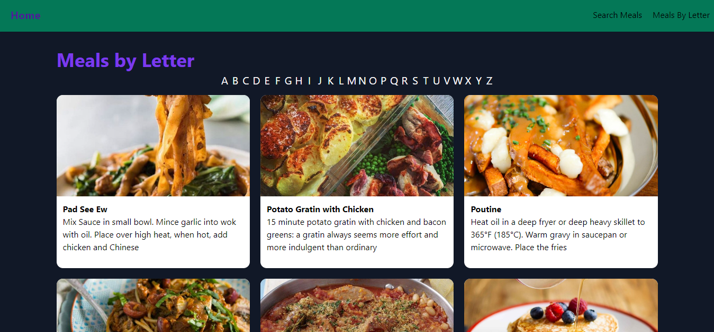

# App Busqueda de platillos

Esta es una aplicacion la cual utiliza una API que se encarga
de brindar de manera aleatoria platillos de comida.

Como podemos ver en la app nos brinda diferentes platillos de comida
de manera aleatoria y nos brinda una imagen, titulo y de manera
resumida la preparacion del platillo.

Una vez seleccionamos uno de los platillos, nos brinda cierta informacion
de este como el platillo, la preparacion, origen, ingredientes y demas.

Al seleccionar uno de los botones de busqueda de un platillo tiene una 
animacion que hace cambiar de color.

La busqueda normal es como cualquier busqueda, en una barra de texto
escribir lo que quieres buscar y te muestra los resultados.

La busqueda por letras, aparecen las letras del abecedario y al dar click
en alguna de estas te mostrara los resultados encontrados con esa letra.

